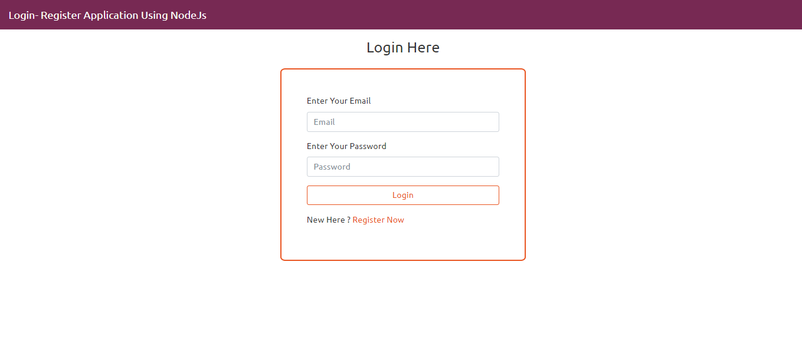
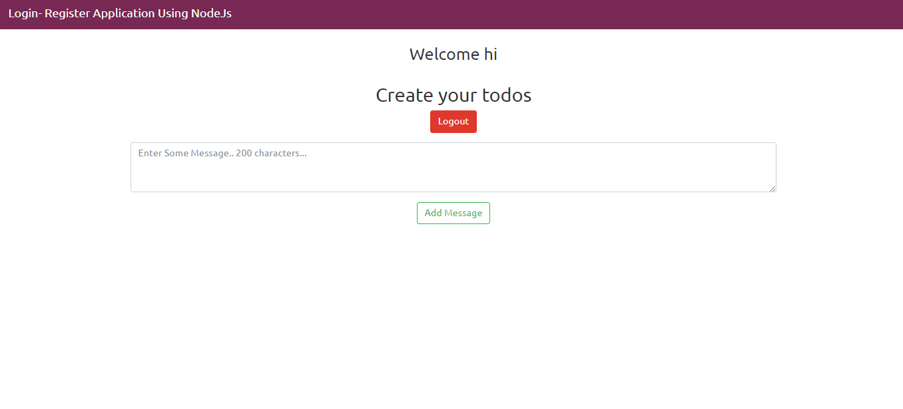

# Login-Register
Login-Register Using PassportJs

  
  

User Authentication using Passport Js
Here is the offical documentation => http://www.passportjs.org/packages/passport-local/

This project consist the Local Strategy to authenticate the user 

It consists of dependency like 

  connect-flash to show the flash message
  
  express-session
  
  MongoDB as a database
  
  Express as a framework
  
  BcryptJs to hash a password
  
  ejs as a templating engine
  
  passportJs.....
  
  

